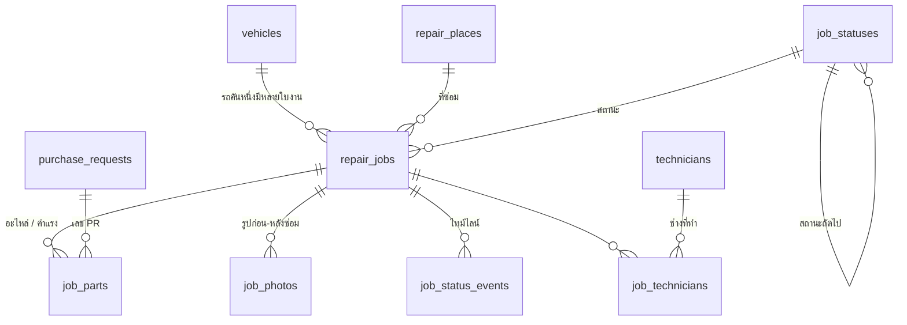

# ฐานข้อมูล Supabase — ระบบแจ้งซ่อมรถบริการ

ออกแบบจากหน้าจอและข้อมูลที่ใช้จริงในแอป (`src/data.js`, `src/constants.js`, `src/utils.js`)

## แนวคิดหลัก

1. **ยอดเงินไม่เก็บซ้ำ** — `job_parts.gross_amount` / `net_amount` เป็น generated column และยอดต่อใบงาน
   อ่านจาก view `job_totals` ทำให้แอปกับฐานข้อมูลคำนวณตรงกันเสมอ ไม่มีทางเพี้ยน
2. **สถานะงานเป็นตาราง ไม่ใช่ enum** — `job_statuses` เก็บทั้งชื่อไทย ลำดับ สถานะถัดไป ข้อความปุ่ม และสีชิป
   (แทน `STATUS` / `ORDER` / `NEXT` / `NEXT_LABEL` ใน `constants.js`) เพิ่มสถานะใหม่ได้โดยไม่ต้องแก้โค้ดและไม่ต้อง `alter type`
3. **PR เป็นตารางของตัวเอง** — ของเดิมเก็บเลข PR เป็น string ในอะไหล่แต่ละชิ้น
   ที่จริงคือความสัมพันธ์ many-to-one: อะไหล่หลายชิ้น (ข้ามใบงานได้) อ้าง PR ใบเดียวกัน
4. **ช่างเป็นตาราง** — ของเดิมเก็บเป็นข้อความ `'ช่างบุญมี + ช่างเอก'` แยกเป็น `technicians` + `job_technicians`
   เพื่อรายงาน "งานต่อช่าง" ได้ในอนาคต
5. **รูปไม่เก็บเป็น base64 ในตาราง** — ตารางเก็บแค่ `storage_path`
   (ปัจจุบันไฟล์อยู่บนดิสก์ของ Go API ดู [../../stores/README.md](../../stores/README.md#ไฟล์รูปเก็บที่ไหน))
6. **ไทม์ไลน์บันทึกอัตโนมัติ** — trigger เขียน `job_status_events` ทุกครั้งที่สถานะเปลี่ยน
   (ของเดิมไทม์ไลน์เป็นข้อความ hardcode 4 บรรทัด)

## ผังความสัมพันธ์



## ตาราง

| ตาราง | เก็บอะไร |
| --- | --- |
| `app_settings` | ค่าตั้งระดับระบบ — อักษรนำหน้าเลขที่ใบงาน |
| `job_statuses` | สถานะงาน 4 สถานะ พร้อมลำดับ สถานะถัดไป ข้อความปุ่ม และสีชิป |
| `vehicles` | ทะเบียนรถ: เบอร์รถ, ทะเบียน, ยี่ห้อ/รุ่น, ประเภท, เลขไมล์ล่าสุด |
| `repair_places` | สถานที่ซ่อม + ผู้ติดต่อ |
| `technicians` | รายชื่อช่าง |
| `purchase_requests` | ใบสั่งซื้อ (PR) |
| `repair_jobs` | ใบงานซ่อม — หัวใจของระบบ |
| `job_parts` | อะไหล่และค่าแรงในใบงาน (ค่าแรงลงเป็นรายการ โดยใช้ `unit` = ชั่วโมง/งาน) |
| `job_technicians` | ช่างที่ทำใบงานนั้น (หลายคนได้, มี `is_lead`) |
| `job_photos` | รูปก่อน/หลังซ่อม → path ใน bucket `job-photos` |
| `job_status_events` | ไทม์ไลน์การเปลี่ยนสถานะ (trigger เขียนให้เอง) |

## View และฟังก์ชันที่แอปเรียกใช้

| ชื่อ | ใช้กับหน้าจอ |
| --- | --- |
| `jobs_list` | รายการงานซ่อม ทั้ง 3 มุมมอง (ตาราง / การ์ด / คิวสถานะ) — รวมยอดเงิน สีชิป จำนวนรูป อายุงานมาให้แล้ว |
| `job_totals` | กล่องสรุปยอดในหน้ารายละเอียดใบงาน |
| `vehicle_summary` | หน้าทะเบียนรถ + การ์ด "รถที่ซ่อมบ่อย" |
| `job_status_counts` | ตัวเลขบนแท็บกรองสถานะ + KPI แดชบอร์ด |
| `monthly_repair_cost` | กราฟค่าซ่อมรายเดือน |
| `pr_summary` | การ์ดใบสั่งซื้อในหน้ารายละเอียด |
| `search_jobs(q, status)` | ค้นหาฝั่งฐานข้อมูล (เบอร์รถ / อาการ / เลขที่ / ช่าง / อะไหล่ / เลข PR) |
| `create_repair_job(...)` | สร้างใบงาน + อะไหล่ + ช่าง + PR ในคำสั่งเดียว (atomic) |
| `advance_job_status(job_id)` | เลื่อนสถานะไปขั้นถัดไปตามผังใน `job_statuses` |

> **แอปเวอร์ชันปัจจุบันไม่เรียก RPC เหล่านี้** — [`src/lib/api.js`](../src/lib/api.js) ใช้คำสั่งระดับตารางทั้งหมด
> เพราะฐานข้อมูลที่เคยรัน migration รุ่นที่มีระบบล็อกอินจะมี `revoke execute` ค้างอยู่กับฟังก์ชัน
> ทำให้ `anon` เรียกไม่ได้ (error `42501`) ฟังก์ชันยังอยู่ในฐานข้อมูลและใช้งานได้ปกติถ้าคืนสิทธิ์ด้วย
> `grant execute on all functions in schema public to anon, authenticated;`
> ข้อแลกเปลี่ยนของการใช้คำสั่งตาราง: การสร้างใบงานใช้หลาย request ไม่เป็น transaction เดียว
> (api.js ลบใบงานที่สร้างค้างให้เองถ้าขั้นตอนถัดไปล้มเหลว)

## เทียบฟิลด์เดิมกับคอลัมน์ใหม่

| ใน `src/data.js` | ในฐานข้อมูล |
| --- | --- |
| `code` | `repair_jobs.code` (default `next_job_code()` → `JR26-0155` ...) |
| `vehicle` | `vehicles.code` ผ่าน `repair_jobs.vehicle_id` |
| `mileage` | `repair_jobs.mileage` (trigger อัปเดต `vehicles.mileage` ให้เป็นค่าล่าสุด) |
| `symptom` / `rootCause` | `repair_jobs.symptom` / `root_cause` |
| `status` | `repair_jobs.status` → `'รออะไหล่'` กลายเป็น `'waiting_parts'` (ชื่อไทยอยู่ใน `job_statuses.label_th`) |
| `tech` | `job_technicians` + `technicians.name` (view คืนเป็นข้อความรวม `'ช่างบุญมี + ช่างเอก'`) |
| `pr` | ยกเลิก — ใช้ `job_parts.pr_id` รายชิ้นแทน, view คืน `pr_codes` เป็น array |
| `reportedAt` / `breakDate` / `doneDate` | `reported_on` / `break_on` / `done_on` (เป็น `date` ไม่ใช่ string `dd/mm/yyyy`) |
| `place` | `repair_places.name` ผ่าน `place_id` |
| `photos` (จำนวน) | นับจาก `job_photos` |
| `age` | คำนวณสด: `current_date - reported_on` |
| `parts[].disc` | `job_parts.discount_pct` |
| `parts[].unitPrice` | `job_parts.unit_price` |

## วิธี apply

**ทางที่ 1 — Supabase CLI** (มี `supabase` ติดตั้งแล้วในเครื่อง)

```bash
cd fleetfix-react
supabase link --project-ref <project-ref>
supabase db push                       # รัน migration ทั้ง 6 ไฟล์
psql "<connection-string>" -f supabase/seed.sql   # ข้อมูลตัวอย่าง (ไม่บังคับ)
```

**ทางที่ 2 — Dashboard** เปิด SQL Editor แล้ววางไฟล์ใน `migrations/` **ตามลำดับเลขหน้า**
(0100 → 0200 → 0300 → 0400 → 0500 → 0600 → 0700 → 0800) จากนั้น `seed.sql`

| ไฟล์ | ทำอะไร |
| --- | --- |
| 0100–0600 | สร้าง schema, view, RLS, bucket |
| 0700 | ตัดสิ่งที่อ้าง `auth.users` ออก (จำเป็นเฉพาะฐานข้อมูลที่เคยรันรุ่นมีระบบล็อกอิน) |
| 0800 | เลิกคิด VAT — สร้าง view ใหม่ให้ยอดรวมเป็นมูลค่าอะไหล่หักส่วนลด |

### ถ้าเคยรัน migration รุ่นที่ยังมีระบบล็อกอิน

รุ่นแรกของ schema นี้มีตาราง `profiles` + trigger บน `auth.users` ถ้า apply ไปแล้ว
สิ่งเหล่านั้นยังอยู่ในฐานข้อมูล (การแก้ไฟล์ SQL ไม่ย้อนไปลบของที่สร้างแล้ว)
ให้รัน `migrations/20260731000700_remove_auth.sql` เพิ่มหนึ่งครั้ง — ไฟล์นั้นจะ:

- ลบ trigger `on_auth_user_created` บน `auth.users` และฟังก์ชัน `handle_new_user()`
- ลบตาราง `profiles` (ตัวที่มี FK ไป `auth.users.id`)
- ลบฟังก์ชัน `is_staff()` / `is_admin()` / `current_role_name()` และ policy รุ่นเก่าที่เรียกใช้
- เปลี่ยน `repair_jobs.created_by`, `job_photos.uploaded_by`, `job_status_events.actor` จาก `uuid` เป็น `text`
- แทน `create_repair_job` รุ่นเก่า (ที่เรียก `auth.uid()`) ด้วยรุ่นที่รับ `p_created_by`

> ตาราง `auth.users` เป็นของ Supabase เอง **ลบไม่ได้และไม่ควรลบ** — Schema Visualizer
> จะยังแสดง schema `auth` อยู่เสมอ แต่หลังรัน 0700 จะไม่มีเส้นเชื่อมจากตารางของเราไปหามันแล้ว

**ทางที่ 3 — ทดสอบในเครื่องก่อน** (ต้องเปิด Docker Desktop)

```bash
supabase start        # ยก Postgres + Studio ในเครื่อง
supabase db reset     # รัน migration + seed ทั้งหมดใหม่
```

## ตัวอย่างการเรียกจากแอป

```js
import { createClient } from '@supabase/supabase-js';
const db = createClient(import.meta.env.VITE_SUPABASE_URL, import.meta.env.VITE_SUPABASE_PUBLISHABLE_KEY);

// หน้ารายการงานซ่อม
const { data: jobs } = await db.from('jobs_list').select('*').order('reported_on', { ascending: false });

// ค้นหา + กรองสถานะ
const { data } = await db.rpc('search_jobs', { q: 'TS-028', p_status: 'waiting_parts' });

// แจ้งซ่อมใหม่
const { data: job } = await db.rpc('create_repair_job', {
  p_vehicle_code: 'TS-028',
  p_symptom: 'เบรกมีเสียงดัง',
  p_break_on: '2026-07-31',
  p_mileage: 183000,
  p_place_name: 'ศูนย์ซ่อมภายใน',
  p_parts: [{ name: 'ผ้าเบรกหน้า', part_no: 'BP-2214', qty: 2, unit: 'ชุด', unit_price: 1850, discount_pct: 10 }],
  p_technicians: ['ช่างบุญมี'],
});

// เลื่อนสถานะ (ปุ่มในหน้ารายละเอียด)
await db.rpc('advance_job_status', { p_job_id: job.id });

// แก้เลข PR รายอะไหล่
const { data: pr } = await db.rpc('upsert_purchase_request', { p_code: 'PR2605030' });
await db.from('job_parts').update({ pr_id: pr }).eq('id', partId);
```

## สิทธิ์ (RLS) — โหมดไม่มีระบบล็อกอิน

ระบบนี้ **ไม่มี auth** ตามที่ออกแบบไว้ ไม่มีตาราง `profiles` และไม่อ้าง `auth.users` ที่ใดเลย

| การกระทำ | ใครทำได้ |
| --- | --- |
| อ่าน / เพิ่ม / แก้ / ลบ ข้อมูลงานซ่อม รถ อะไหล่ สถานที่ | ทุกคนที่มี URL + publishable key |
| อ่านค่าตั้งระบบและตารางสถานะงาน | ทุกคน |
| **แก้** ค่าตั้งระบบและตารางสถานะงาน | ผ่าน Dashboard / `service_role` เท่านั้น |
| อ่าน / อัปโหลด / ลบ รูปใน Storage | ทุกคนที่มี key |

> ⚠️ publishable key ถูกฝังในไฟล์ JS ของหน้าเว็บ ใครเปิดเว็บก็อ่านค่านี้ได้
> เท่ากับว่า **ใครที่เข้าถึงหน้าเว็บได้ก็แก้ข้อมูลทั้งฐานได้** เหมาะกับใช้ในวงปิด
> (เครื่องในสำนักงาน / เน็ตภายใน) ถ้าจะเปิดให้คนนอกเข้าถึง ต้องใส่ auth กลับมาก่อน

RLS ยังเปิดอยู่ทุกตาราง (ไม่ได้ปิด) — ตอนอยากเข้มขึ้นแค่แทน policy `<ตาราง>_all`
ในไฟล์ `0500_rls.sql` ด้วยเงื่อนไขที่ต้องการ ไม่ต้องแก้โครงตาราง

ผู้คีย์ข้อมูลบันทึกเป็นข้อความในคอลัมน์ `repair_jobs.created_by`
(ส่งผ่านพารามิเตอร์ `p_created_by` ของ `create_repair_job`) ไม่ได้ผูกกับบัญชีผู้ใช้

## หมายเหตุ

- **ระดับการตรวจแล้ว:** ทุกไฟล์ผ่าน parser ของ PostgreSQL 17 จริง (`@pgsql/parser`) — syntax ระดับ SQL ถูกต้องทั้งหมด
  แต่ยังไม่ได้ **รัน** กับฐานข้อมูลจริง จึงยังไม่ได้ตรวจส่วนที่ parser มองไม่เห็น ได้แก่ เนื้อในฟังก์ชัน PL/pgSQL
  (ระหว่าง `$$ ... $$`) และความถูกต้องเชิงความหมาย เช่นชื่อคอลัมน์ใน view
  แนะนำให้ `supabase db reset` ในเครื่อง (ต้องเปิด Docker) หรือให้ผมช่วย apply ผ่าน connector แล้วรัน advisor ตรวจความปลอดภัยให้
- `anon` (ผู้ที่ยังไม่ล็อกอิน) ถูก `revoke` สิทธิ์ทุกตารางและ view ไว้อีกชั้นนอกเหนือจาก RLS
- แอป React ปัจจุบันยังใช้ข้อมูลใน `src/data.js` อยู่ ยังไม่ได้ต่อฐานข้อมูลนี้
